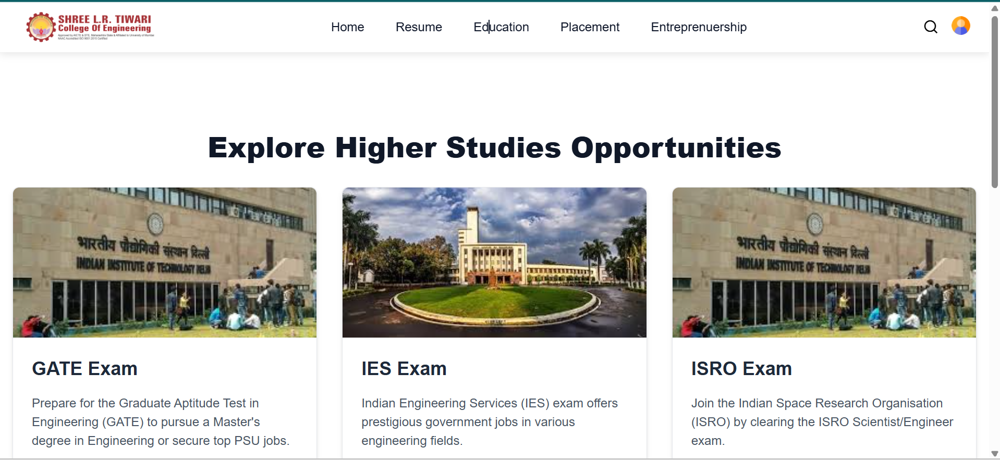
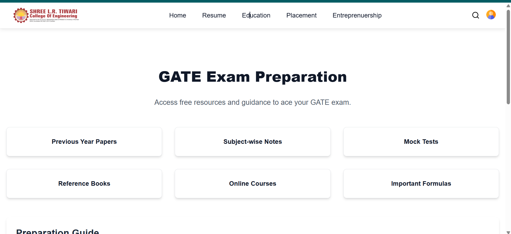
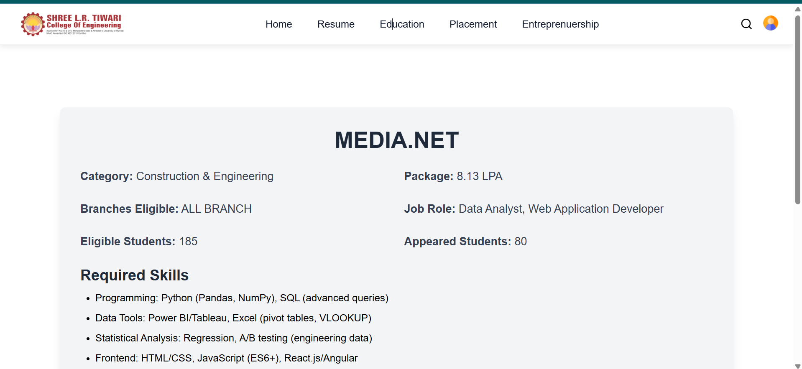
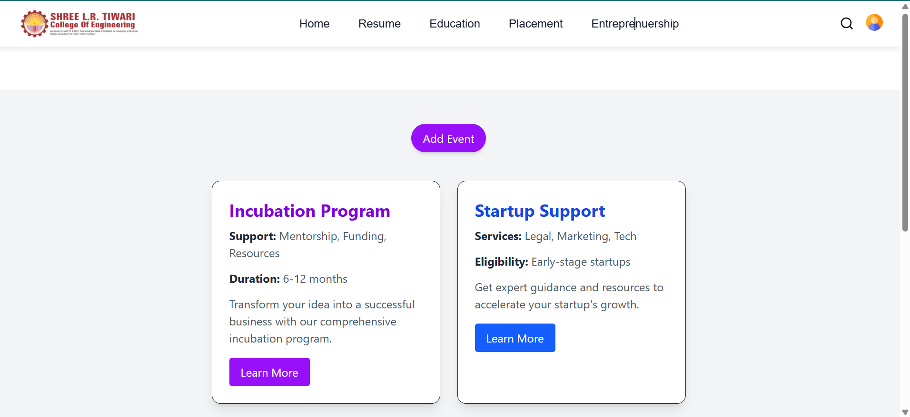
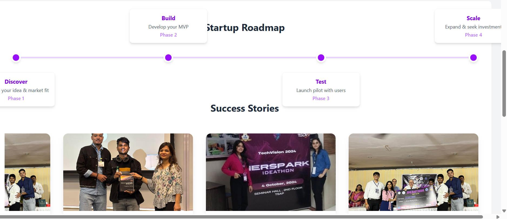

# 🎓 CampusCompass

**CampusCompass** is an AI-powered web platform designed to guide students through their academic and career journeys. From resume analysis and placement readiness prediction to higher studies resources, company insights, and real-time internship updates — CampusCompass empowers students with the tools they need to make informed decisions about their future.

---

## 🚀 Features

- 📄 **Resume Analyzer**  
  Analyze your resume and get actionable suggestions to improve your placement chances.

- 🧠 **Placement Readiness Prediction (Naive Bayes)**  
  Uses machine learning to predict your placement readiness based on academic and skill-based inputs.

- 📚 **Higher Studies Guidance**  
  Get personalized suggestions for higher studies options (like GATE, GRE, CAT, UPSC, etc.) based on your profile.

- 🏢 **Placement Insights**  
  - Company-wise stats (visit dates, job roles, CTC, eligible branches)
  - Visual analytics for past placement data

- 📢 **Real-Time College Event & Internship Updates**  
  Admins can post new opportunities and students get live updates instantly.

- 🔍 **Search & Filter Tools**  
  Easily find companies, internships, or events.

---

## 🛠️ Tech Stack

- **Frontend**: React.js  
- **Backend**: Node.js / Express OR Python Flask  
- **Database**: MongoDB  
- **AI/ML**: Scikit-learn (Naive Bayes for classification)  
- **Authentication**: JWT-based Auth (Login for Admin/Students)  
- **Styling**: TailwindCSS 


## 🧠 How It Works

1. **Student uploads resume**
2. NLP parses key elements (skills, education, experience)
3. Naive Bayes model predicts placement readiness score
4. Based on results, platform recommends:
   - Resume improvements
   - Skills to acquire
   - Jobs/internships that match
   - Higher studies exams/resources


## 🧪 Run Locally

```bash
# Clone the repo
git clone https://github.com/tsuhani-19/CampusCompass.git

# Go into frontend
cd client
npm install
npm run dev

# Go into backend
cd ../server
npm install
npm start












